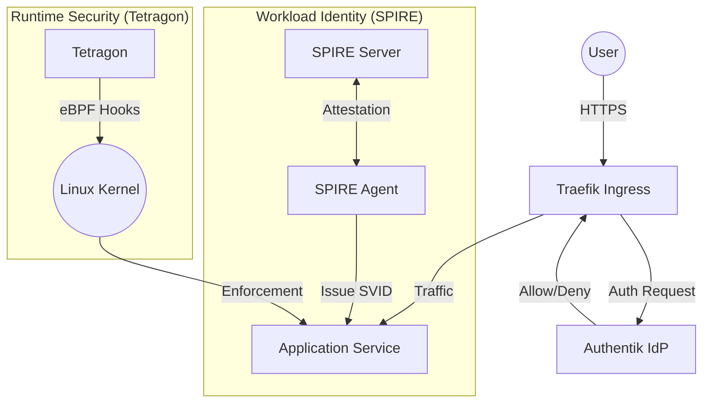
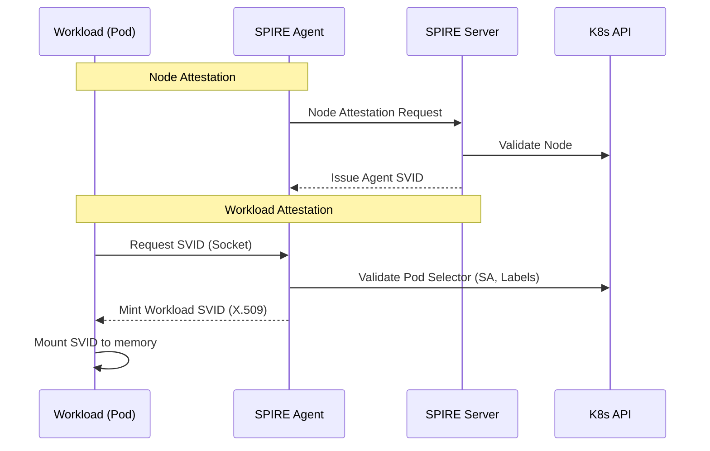
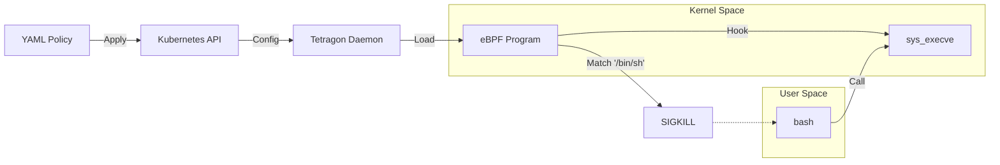
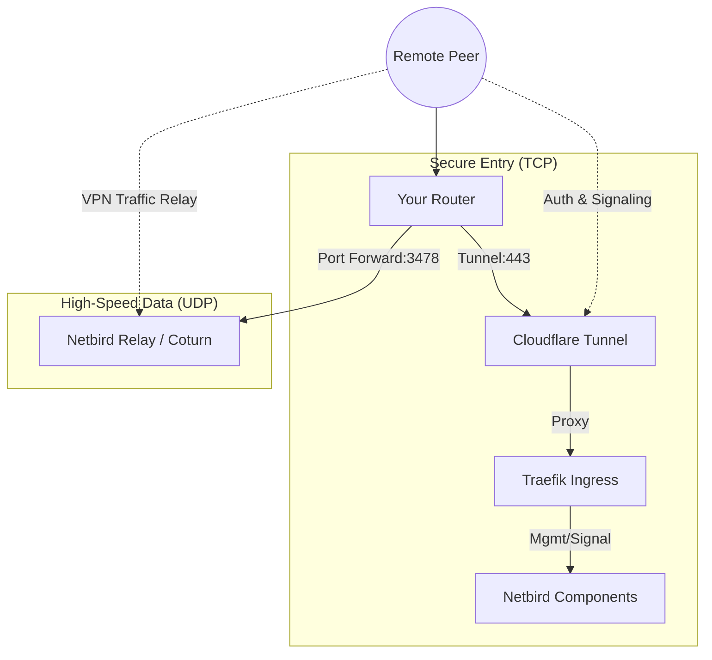

# Homelab Production Identity Stack (v5)

This repository contains the configuration for a production-grade identity and security stack for a Kubernetes homelab. It integrates user identity (Authentik), workload identity (SPIRE), and runtime enforcement (Tetragon/Cilium).

## Architecture Overview

## Architecture Overview

The stack is designed to provide Zero Trust principles at multiple layers:



1.  **User Identity**: Managed by **Authentik**, providing SSO and centralized authentication for all ingress services.
2.  **Workload Identity**: Managed by **SPIRE** (SPIFFE Runtime Environment), issuing short-lived X.509 certificates to workloads for mTLS and authentication.
3.  **Runtime Security**: Managed by **Tetragon** (via Cilium), enforcing process execution and network policies at the kernel level using eBPF.

## Directory Structure

*   `cluster/`: Bootstrap configurations and ArgoCD Application definitions (including Networking).
*   `apps/`: User-facing applications (e.g., example apps).
*   `infra/`: Infrastructure components (Cilium, SPIRE, Tetragon, ArgoCD).
*   `security/`: Security-specific configurations (Authentik, Databases, Policies).
*   `bootstrap/`: Initial cluster bootstrap scripts (if applicable).

## Components

### Identity Provider (Authentik)

Located in: `security/authentik`

Authentik is deployed via ArgoCD and handles user authentication.
*   **Database**: Uses CloudNativePG (`security/database`).
*   **Ingress**: protect services via Traefik middleware or forward auth.

### Workload Identity (SPIRE)

Located in: `infra/spire`

SPIRE issues identities to workloads based on k8s selectors.
*   **Trust Domain**: `homelab.internal`
    *   **Note**: This is an separate internal logical identifier for SPIFFE IDs (e.g., `spiffe://homelab.internal/ns/default/sa/my-app`). It does **NOT** need to be a real DNS domain or public domain. It is an arbitrary string that defines the security boundary of the mesh.
*   **Agent**: Runs as a DaemonSet on every node.
*   **Server**: Central authority for minting SVIDs.

**Key Features:**
*   Automated certificate rotation (`rotation-config.yaml`).
*   Workload attestation via Kubernetes projected service account tokens.



### Runtime Security (Tetragon)

Located in: `infra/tetragon`

Tetragon provides deep visibility and enforcement.
*   **Policies**: Defined in `security/policies/tetragon/block-shell.yaml`.
*   **Enforcement**: Can sigkill processes that violate policies (e.g., unexpected shell execution).



### Remote Access (Netbird)

Located in: `cluster/networking`

Netbird provides a secure peer-to-peer overlay network for remote access.
*   **Deployment**: Managed via ArgoCD (`cluster/networking/netbird.yaml`).
*   **Integration**: Deployed to `networking` namespace.

**Self-Hosted Architecture**:
This deployment is fully self-hosted. It replaces the Netbird.io SaaS.
*   **Management**: Stores configuration and peer state (Internal).
*   **Signal**: Facilitates peer-to-peer connection negotiation (Internal).
*   **Relay (TURN)**: Relays traffic when P2P fails (Internal/Coturn).
*   **Dashboard**: Web UI for management (Internal).
*   **External Dependency**: None (except for public DNS/Ingress as noted below).

**Cloudflare Tunnel Integration (Hybrid)**:

To maximize both security and performance, this stack uses a **Hybrid Networking** model.



*   **Management Plane (Cloudflare Tunnel)**: All control traffic (Dashboard, Management API, and gRPC Signal) goes through the Cloudflare Tunnel. This hides your public IP and provides DDoS protection for the "brains" of the network.
*   **Data Plane (UDP Port Forwarding)**: Netbird uses WireGuard for peer-to-peer traffic. If peers cannot connect directly, they use the **Relay (TURN)** server. This server uses UDP port 3478. Because Cloudflare Tunnel (standard) does not support UDP traffic with the performance required for a VPN, you **MUST** forward UDP port 3478 on your router directly to the cluster. This ensures your VPN remains fast and reliable.

**Configuration Required**:
You **MUST** configure your public domain in `cluster/networking/netbird.yaml`.
*   **Real Domain Required**: Because this stack uses Let's Encrypt with HTTP-01 challenges (`acme-clusterissuer.yaml`), you cannot use a local domain (like `.local`). You must use a **real public domain** (e.g., `netbird.yourdomain.com`) that resolves to your cluster's Ingress/LoadBalancer IP.
*   **How to Configure**: Edit `cluster/networking/netbird.yaml` and uncomment/update the `helm.values` section with your domain.

## Getting Started

### Prerequisites

*   Kubernetes Cluster (k3s/Talos recommended for Cilium compatibility).
*   Cilium installed as CNI.
*   Helm & ArgoCD.

### Deployment

The stack is managed via GitOps (ArgoCD).

1.  **Bootstrap Infrastructure**:
    Apply the infrastructure applications first.
    ```bash
    kubectl apply -f infra/
    ```

2.  **Deploy Security Services**:
    Once infra is healthy, deploy the security layer.
    ```bash
    kubectl apply -f security/
    ```

## Usage Guides

### Onboarding a Service to SPIRE

Add a `SpiffeID` CRD or equivalent registration entry mapping the service account to a SPIFFE ID.
See `apps/example-spiffe-enabled-deployment.yaml` (if available) for reference.

### rotating SPIRE Certificates

Certificates are rotated automatically by the SPIRE Agent based on `default_svid_ttl` (configured to 1h). No manual intervention is required unless the root CA is expiring.

### Applying Tetragon Policies

To block specific behaviors (e.g., shell access in production pods):

```yaml
apiVersion: cilium.io/v1alpha1
kind: TracingPolicy
metadata:
  name: block-shell
spec:
  kprobes:
  - call: "sys_execve"
    syscall: true
    selectors:
    - matchArgs:
      - index: 0
        operator: "Equal"
        values:
        - "/bin/sh"
      action: Post
```

Apply with `kubectl apply -f <policy.yaml>`.
