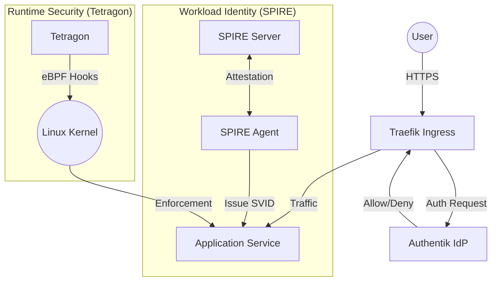
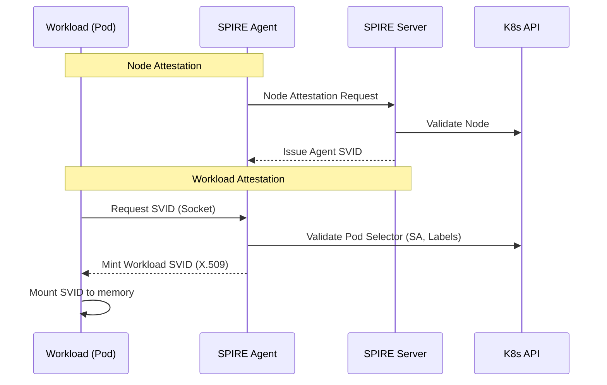
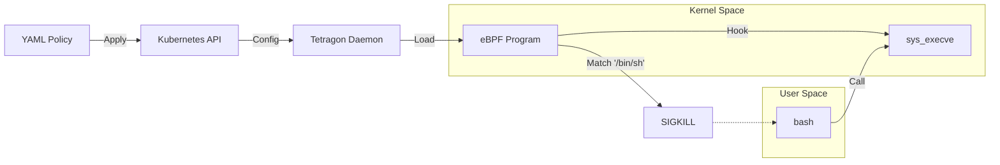
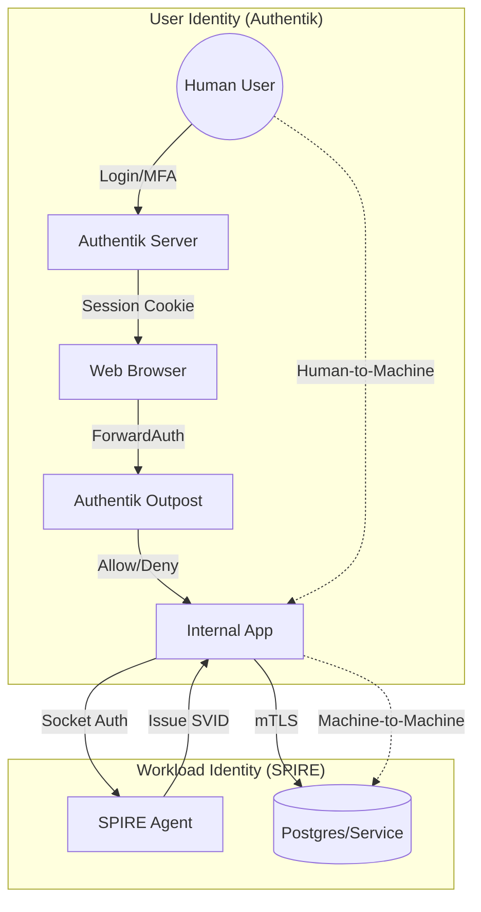
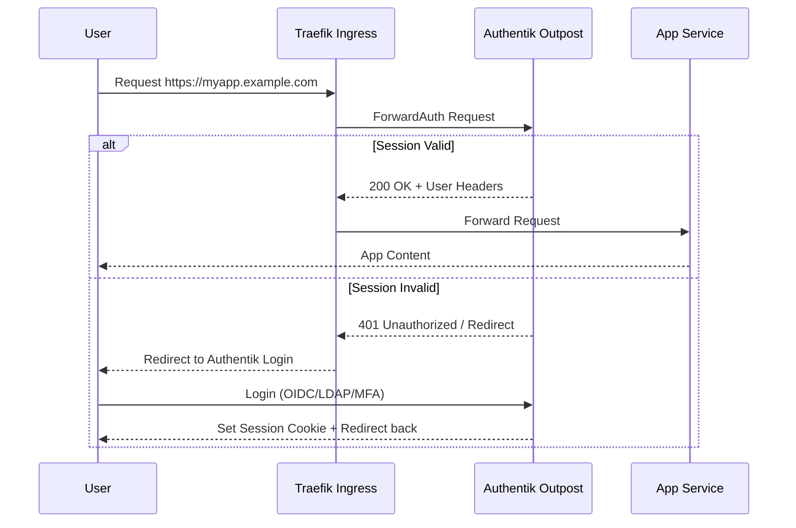
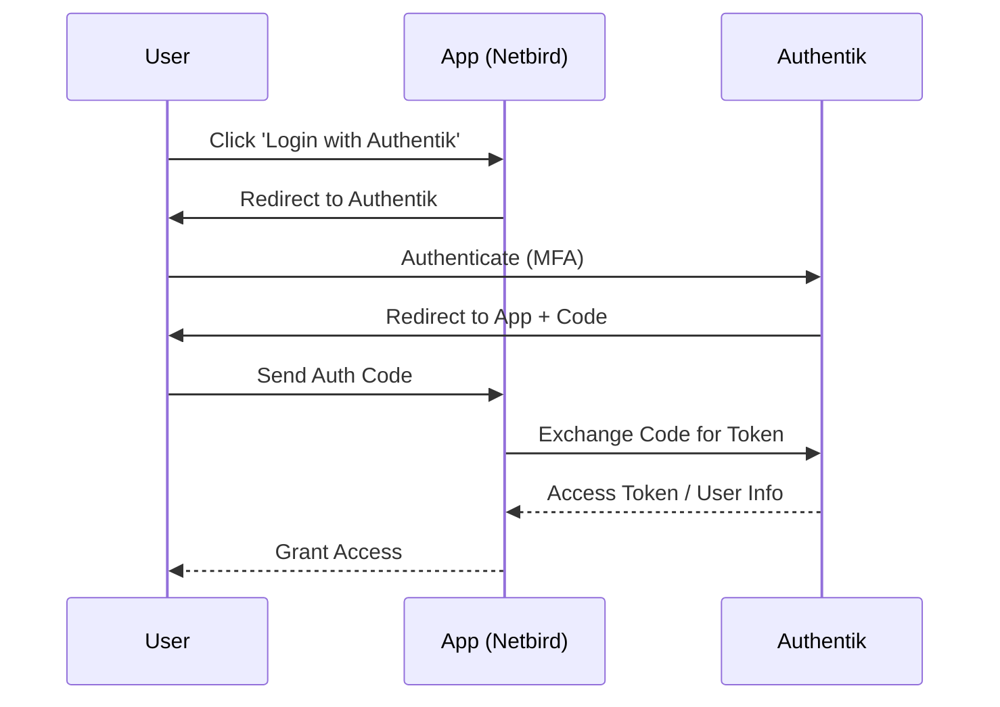
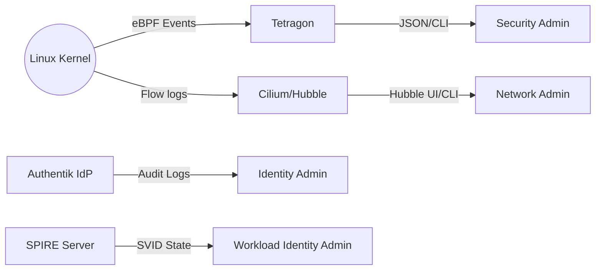

# Homelab Production Identity Stack (v5)

This repository contains the configuration for a production-grade identity and security stack for a Kubernetes homelab.

## Design Philosophy

This stack is built on three core pillars:
1.  **Zero Trust Networking**: No pod is trusted by default. All access (user and machine) must be authenticated and authorized.
2.  **Identity-at-Source**: Identities are issued based on cryptographic attestation (SPIRE) or strong MFA (Authentik), not just IP addresses or network location.
3.  **Kernel-Level Enforcement**: We move security checks into the Linux Kernel (eBPF) to prevent user-space bypass and ensure high-performance enforcement.

## Architecture Overview

The stack is designed to provide Zero Trust principles at multiple layers:



1.  **User Identity**: Managed by **Authentik**, providing SSO and centralized authentication for all ingress services.
2.  **Workload Identity**: Managed by **SPIRE** (SPIFFE Runtime Environment), issuing short-lived X.509 certificates to workloads for mTLS and authentication.
3.  **Runtime Security**: Managed by **Tetragon** (via Cilium), enforcing process execution and network policies at the kernel level using eBPF.

## Directory Structure

*   `cluster/`: Bootstrap configurations and ArgoCD Application definitions (including Networking).
*   `apps/`: User-facing applications (e.g., example apps).
*   `infra/`: Infrastructure components (Cilium, SPIRE, Tetragon, ArgoCD).
*   `security/`: Security-specific configurations (Authentik, Databases, Policies).
*   `bootstrap/`: Initial cluster bootstrap scripts (if applicable).

## Components

### Identity Provider (Authentik)

Located in: `security/authentik`

Authentik is deployed via ArgoCD and handles user authentication.
*   **Database**: Uses CloudNativePG (`security/database`).
*   **Ingress**: protect services via Traefik middleware or forward auth.

> [!TIP]
> **Why Authentik?**: We centralize identity to ensure a consistent security posture (MFA, password policies, and audit logging) across every single application in the lab, whether they natively support OIDC or not.

### Workload Identity (SPIRE)

Located in: `infra/spire`

SPIRE issues identities to workloads based on k8s selectors.
*   **Trust Domain**: `homelab.internal`
    *   **Note**: This is an separate internal logical identifier for SPIFFE IDs (e.g., `spiffe://homelab.internal/ns/default/sa/my-app`). It does **NOT** need to be a real DNS domain or public domain. It is an arbitrary string that defines the security boundary of the mesh.
*   **Agent**: Runs as a DaemonSet on every node.
*   **Server**: Central authority for minting SVIDs.

> [!IMPORTANT]
> **Why SPIRE?**: Static secrets (API keys, long-lived tokens) are a liability. SPIRE issues **short-lived, auto-rotating identities (SVIDs)**. If a pod is compromised, the "blast radius" is limited to minutes, and the identity cannot be used outside the cluster.

**Key Features:**
*   Automated certificate rotation (`rotation-config.yaml`).
*   Workload attestation via Kubernetes projected service account tokens.



### Runtime Security (Tetragon)

Located in: `infra/tetragon`

Tetragon provides deep visibility and enforcement.
*   **Policies**: Defined in `security/policies/tetragon/block-shell.yaml`.
*   **Enforcement**: Can sigkill processes that violate policies (e.g., unexpected shell execution).

> [!CAUTION]
> **Why Tetragon?**: Traditional security tools often rely on "poking" logs or user-space agents that can be bypassed. By using **eBPF**, Tetragon observes and blocks malicious activity (like `execve` calls) directly in the kernel, making it nearly impossible for an attacker to hide their tracks.



### Remote Access (Netbird)

Located in: `cluster/networking`

Netbird provides a secure peer-to-peer overlay network for remote access.
*   **Deployment**: Managed via ArgoCD (`cluster/networking/netbird.yaml`).
*   **Integration**: Deployed to `networking` namespace.

**Self-Hosted Architecture**:
This deployment is fully self-hosted. It replaces the Netbird.io SaaS.
*   **Management**: Stores configuration and peer state (Internal).
*   **Signal**: Facilitates peer-to-peer connection negotiation (Internal).
*   **Relay (TURN)**: Relays traffic when P2P fails (Internal/Coturn).
*   **Dashboard**: Web UI for management (Internal).
*   **External Dependency**: None (except for public DNS/Ingress as noted below).

**Cloudflare Tunnel Integration (Hybrid)**:

To maximize both security and performance, this stack uses a **Hybrid Networking** model.

```mermaid
graph TD
    Peer((Remote Peer)) --> CFEdge[Cloudflare Edge / Global Network]
    
    subgraph "Your Local Network"
        Router[Your Router / Firewall]
        subgraph "Kubernetes Cluster"
            CFPod[cloudflared Pod]
            Ingress[Traefik Ingress]
            NetbirdAPI[Netbird Components]
            Coturn[Netbird Relay / Coturn]
        end
    end
    
    %% Secure Path
    CFEdge <-->|Outbound Secure Tunnel| CFPod
    CFPod -->|Proxy| Ingress
    Ingress -->|Mgmt/Signal| NetbirdAPI
    
    %% Data Path
    Peer -->|UDP 3478: Port Forward| Router
    Router -->|UDP| Coturn
    
    Peer -.->|Control Plane Traffic| CFEdge
    Peer -.->|VPN Data Relay| Router
```



*   **Management Plane (Cloudflare Tunnel)**: This uses an **Outbound Connection** model. The `cloudflared` pod inside your cluster initiates the connection to Cloudflare's Edge.
    *   **Security Benefit**: You do **NOT** need to open any inbound TCP ports (like 443) on your router.
    *   **Features**: Control traffic (Dashboard, Management API, Signal) is proxied securely, hiding your public IP and providing DDoS protection.
*   **Data Plane (UDP Port Forwarding)**: Netbird uses WireGuard for peer-to-peer traffic. If peers cannot connect directly, they use the **Relay (TURN)** server on UDP port 3478. Because standard Cloudflare Tunnels do not support the low-latency UDP performance required for a VPN relay, this connection stays direct. You **MUST** forward UDP port 3478 on your router.

> [!NOTE]
> **Why Hybrid?**: This model balances **Security** (Cloudflare Tunnel hides your Management UI and Signal brain from the public internet) with **Performance** (Direct UDP ensures your actual VPN data travels as fast as possible without tunnel overhead).

**Configuration Required**:
You **MUST** configure your public domain in `cluster/networking/netbird.yaml`.
*   **Real Domain Required**: Because this stack uses Let's Encrypt with HTTP-01 challenges (`acme-clusterissuer.yaml`), you cannot use a local domain (like `.local`). You must use a **real public domain** (e.g., `netbird.yourdomain.com`) that resolves to your cluster's Ingress/LoadBalancer IP.
*   **How to Configure**: Edit `cluster/networking/netbird.yaml` and uncomment/update the `helm.values` section with your domain.

## Getting Started

### Prerequisites

This stack leverages advanced kernel features (eBPF) and GitOps patterns. Ensure your environment meets these requirements before proceeding.

#### 1. Kubernetes Distribution
We recommend distributions that allow disabling the default CNI to ensure **Cilium** has full control over the networking stack.

*   **k3s**:
    *   Must be installed with Flannel and Kube-Proxy disabled for maximum Cilium performance:
        ```bash
        curl -sfL https://get.k3s.io | sh -s - \
          --flannel-backend=none \
          --disable-kube-proxy \
          --disable network-policy
        ```
*   **Talos Linux**:
    *   Set `cluster.network.cni.name: none` in your machine configuration.
    *   Required for full Tetragon compatibility and seamless eBPF integration.

#### 2. Kernel Requirements
Since **Tetragon** and **Cilium** operate at the eBPF layer, the underlying host kernel must support:
*   **Version**: Linux Kernel **5.10+** (5.15+ recommended).
*   **Config**: `CONFIG_DEBUG_INFO_BTF=y` (allows eBPF programs to understand kernel types).
*   **Mounts**: BPF filesystem must be mounted (standard on modern distros).

#### 3. Storage & Secrets
*   **Storage**: A default storage class configured (e.g., Local Path Provisioner, Longhorn) for Postgres.
*   **SOPS**: An age/PGP key for decrypting repository secrets.
*   **Cloudflare**: A `cloudflared-token` in the `infra` namespace:
    ```bash
    kubectl create secret generic cloudflared-token --namespace infra --from-literal=token=<token>
    ```

#### 4. Required Tools
Ensure the following are installed locally:
*   **Helm 3.x**: For initial bootstrap of operators.
*   **ArgoCD CLI**: To monitor the "App-of-Apps" sync status.
*   `hubble` and `tetra` CLIs for deep visibility.

### Deployment Guide

This stack is managed via a GitOps "App-of-Apps" pattern using ArgoCD.

### 1. Bootstrapping (Stage 1)

Apply the foundational namespaces and the root ArgoCD application:

```bash
# 1. Create the base namespaces
kubectl apply -f cluster/infra/namespaces.yaml

# 2. Deploy the root ArgoCD application
kubectl apply -f cluster/infra/argocd-apps.yaml
```

This will automatically deploy:
*   `cert-manager` (for automated TLS)
*   `cloudnative-pg` (Postgres operator)
*   `external-secrets` (if using vault/asm/etc.)

### 2. Deploying the Stack (Stage 2)

Once the core infrastructure is healthy, apply the remaining stack layers:

```bash
# Deploy Infra (SPIRE, Tetragon)
kubectl apply -k cluster/infra/

# Deploy Security (Authentik, Policies)
kubectl apply -k cluster/security/

# Deploy Networking (Netbird, Ingress)
kubectl apply -k cluster/networking/
```

### 3. Post-Deployment Configuration

1.  **Netbird Domain**: Edit `cluster/networking/netbird.yaml` and set your public domain.
2.  **Hybrid Networking**: Forward UDP Port `3478` on your router to the cluster LoadBalancer IP for Netbird Relay performance.
3.  **Trust Domain**: Ensure your SPIRE trust domain (`homelab.internal`) matches in `infra/spire/rotation-config.yaml`.

## Verification

Monitor the deployment in the ArgoCD UI or via CLI:
```bash
kubectl get pods -A
kubectl get tracingpolicy -A
```

## Identity & SSO Architecture

This stack provides a dual-pillared identity system designed for Zero Trust: **User Identity** for humans and **Workload Identity** for machines.

### The Two Pillars of Identity



| Feature | User Identity (Authentik) | Workload Identity (SPIRE) |
| :--- | :--- | :--- |
| **Identity For** | Humans (Users/Admins) | Machines (Pods/Services) |
| **Credential** | Session Cookies / JWTs | X.509 SVIDs / mTLS |
| **Source of Truth**| LDAP / Database / Social | Kubernetes API / Node Attestation |
| **Life Span** | Hours/Days (User Session) | Minutes/Hours (Short-lived certs) |

---

### Understanding the SSO Flows

#### 1. Proxy Flow (ForwardAuth)
Used for applications that **do not** natively support OIDC/SAML. The Ingress Controller acts as a gatekeeper.



*   **Mechanism**: Traefik intercepts the request and asks the **Authentik Outpost** if the user is authenticated.
*   **Best For**: Legacy apps, dashboards, or anything without a login button.

#### 2. Native Flow (OIDC)
Used for applications that **do** support OIDC (e.g., Netbird, Grafana).



*   **Mechanism**: The app directly redirects to Authentik via standard OpenID Connect protocols.
*   **Best For**: Netbird, modern web apps, and any service requiring granular group/role sync.

---

### How to Onboard an Application

To protect a new internal service with SSO, follow these steps:

1.  **Create Provider**: In the Authentik UI, go to `Resources -> Providers` and create a **Proxy Provider**.
    *   **Authorization flow**: default-provider-authorization-implicit-consent
    *   **External host**: `https://myapp.example.com`
2.  **Create Application**: Go to `Resources -> Applications` and create an application linked to the Provider.
3.  **Define Middleware (Traefik)**: Ensure a `Middleware` resource exists in Kubernetes pointing to your Authentik Outpost:
    ```yaml
    apiVersion: traefik.io/v1alpha1
    kind: Middleware
    metadata:
      name: authentik-sso
      namespace: security
    spec:
      forwardAuth:
        address: http://authentik-outpost-embedded.security.svc.cluster.local:9000/outpost.goauthentik.io/auth/traefik
        trustForwardHeader: true
        authResponseHeaders:
          - X-authentik-username
          - X-authentik-groups
    ```
4.  **Protect the Ingress**: Add the middleware annotation to your application's Ingress:
    ```yaml
    annotations:
      traefik.ingress.kubernetes.io/router.middlewares: security-authentik-sso@kubernetescrd
    ```

## Observability & Visibility

This stack provides deep visibility into the cluster's lifecycle, from network flows to process execution.

### Observability Pipeline



### 1. Network Visibility (Hubble)
Hubble provides L3/L4 and L7 visibility for all pod traffic.
*   **Hubble UI**: Accessible via `http://localhost:12000` after port-forwarding:
    ```bash
    kubectl port-forward -n kube-system svc/hubble-ui 12000:80
    ```
*   **Hubble CLI**: Watch live traffic flows:
    ```bash
    hubble observe --follow --namespace apps
    ```

### 2. Runtime Security Visibility (Tetragon)
Tetragon monitors syscalls and process execution across the cluster.
*   **Live Events**: Stream JSON events or use the `tetra` CLI:
    ```bash
    kubectl logs -n kube-system -l app.kubernetes.io/name=tetragon -c export-stdout -f | tetra observe
    ```

### 3. Identity Visibility (Authentik & SPIRE)
*   **User Audit**: Authentik logs every login, token issuance, and policy evaluation. View these in the **Authentik Admin Interface** under `Events -> Log`.
*   **Workload Identities**: Check which pods have valid SPIRE identities:
    ```bash
    kubectl exec -irn spire-system spire-server-0 -- \
      bin/spire-server entry show
    ```

### 4. GitOps Visibility (ArgoCD)
Track the deployment state and health of the entire stack:
*   **ArgoCD UI**: Use the ArgoCD dashboard to see real-time diffs and sync status for all applications in the `cluster/` directory.

## Usage Guides

### Onboarding a Service to SPIRE

Add a `SpiffeID` CRD or equivalent registration entry mapping the service account to a SPIFFE ID.
See `apps/example-spiffe-enabled-deployment.yaml` (if available) for reference.

### rotating SPIRE Certificates

Certificates are rotated automatically by the SPIRE Agent based on `default_svid_ttl` (configured to 1h). No manual intervention is required unless the root CA is expiring.

### Applying Tetragon Policies

To block specific behaviors (e.g., shell access in production pods):

```yaml
apiVersion: cilium.io/v1alpha1
kind: TracingPolicy
metadata:
  name: block-shell
spec:
  kprobes:
  - call: "sys_execve"
    syscall: true
    selectors:
    - matchArgs:
      - index: 0
        operator: "Equal"
        values:
        - "/bin/sh"
      action: Post
```

Apply with `kubectl apply -f <policy.yaml>`.
## Resilience & Reliability

This stack is designed to be a "critical service" backbone for your homelab. It incorporates several features to ensure high availability and data integrity.

### 1. High Availability (HA)
*   **Quorum-Based Database**: The Authentik database (CNPG) is configured with **3 instances**. This ensures that the cluster can lose one node while maintaining full read/write availability and data consistency.
*   **Stateless Scaling**: Authentik and SPIRE are designed to be horizontally scalable. For high-traffic or critical environments, we recommend increasing the `replicas` to `2` in their respective Helm values.
*   **Load Balancing**: Traefik and Cloudflare provide redundant entry points and automatic failover for incoming traffic.

### 2. Self-Healing (GitOps)
The entire stack is managed by **ArgoCD** with `selfHeal: true`. 
*   If a configuration is accidentally deleted or drifts, ArgoCD will automatically restore it to the desired state defined in this repository.
*   If a core component (like the Authentik server) crashes, Kubernetes will automatically restart the pod, and ArgoCD will ensure the surrounding infrastructure stays synced.

### 3. Data Integrity & Backups
*   **CNPG Failover**: In the event of a primary node failure, CloudNativePG performs an automated failover to a standby node in seconds.
*   **WAL Archiving**: We recommend configuring a standard S3-compatible bucket for CNPG WAL (Write-Ahead Log) archiving for point-in-time recovery (PITR).

### 4. Zero-Trust Recovery (Break-Glass)
In the event of a complete SSO lockout:
1.  **Direct API Access**: Use `kubectl` to interact with the Authentik API directly within the cluster.
2.  **Emergency User**: Authentik maintains a local bootstrap user that can be used via port-forwarding to the service, bypassing external Ingress.
3.  **GitOps Override**: You can temporarily disable ArgoCD sync to make rapid manual changes during a disaster recovery scenario.
